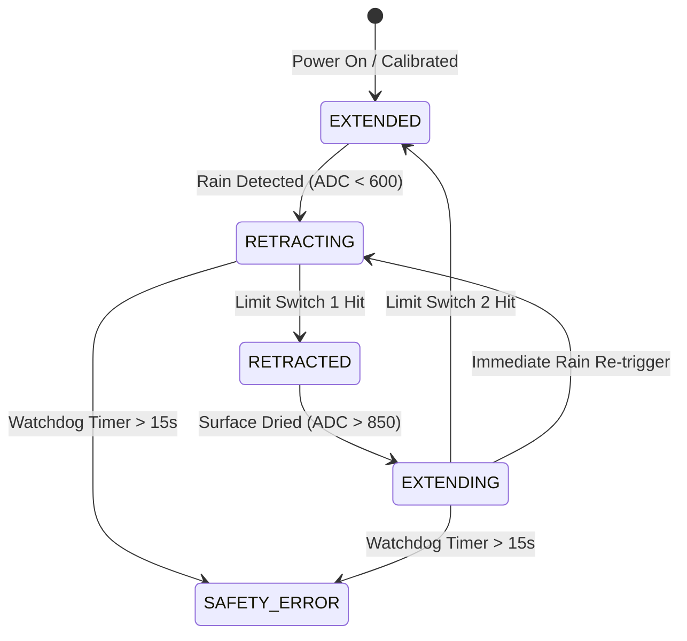

# Automatic Rain-Sensing Retractable Clothesline (2024–2025)

> **IoT Automation Project** developed by **Sujaya K S** (Electronics and Communication Engineering, Dr. N.G.P. Institute of Technology) and demonstrated during the **TRIOX Technology IoT Internship**.

---

## 📌 Project Overview

Sudden rain showers frequently ruin laundry left outside to dry, especially when residents are away from home. The **Automatic Rain-Sensing Retractable Clothesline** is an autonomous IoT-ready mechatronic system that continuously monitors meteorological moisture levels and physically retracts laundry into a waterproof protective housing upon rain onset. Once clear skies return and the sensor dries, it automatically restores the clothesline to the open sun.

---

## 🌟 Key Engineering Features

- **10-Point Moving Average Digital Filter**: Filters electrical noise, high atmospheric humidity, and morning dew to prevent false motor triggers.
- **Hysteresis Thresholds**: Built-in 250-point ADC deadband prevents hunting/jittering around the threshold point.
- **Mechanical End-Stop Protection**: Industrial microswitches ensure zero strain on pulleys and instant motor shutoff upon full retraction or extension.
- **Watchdog Emergency Cutoff**: If limit switches fail to engage within 15 seconds due to a snag, the microcontroller executes an emergency shutdown to prevent motor burnout.
- **Cloud & Serial Telemetry**: Real-time logging of moisture percentages and finite state transitions.

---

## 📐 System State Diagram

---

## 📂 Directory Contents

- [`rain_sensing_clothesline.ino`](rain_sensing_clothesline.ino): Production Arduino / NodeMCU C++ source code with filter math and state engine.
- [`wiring_guide.md`](wiring_guide.md): Complete pinout diagrams, schematic connections, and sensor calibration chart.

---

## 🚀 How to Run & Calibrate

1. Connect the FC-37 sensor analog output to **A0** and L298N motor driver inputs to **Pins 5, 6, 7**.
2. Open `rain_sensing_clothesline.ino` in Arduino IDE.
3. Select board: `Arduino Uno` or `NodeMCU 1.0 (ESP-12E)`.
4. Upload code and open Serial Monitor at **9600 baud**.
5. Use a spray bottle or wet cotton swab to simulate raindrops and observe the automated motor retraction sequence and telemetry reports!
